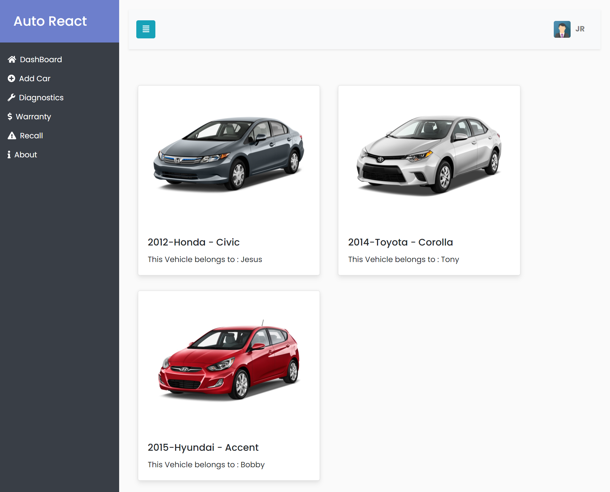

# Auto React

This project is a personal project I built while attending Nucamp Coding Bootcamp.
It was built using React.js.

The idea of my project was to create a web app where someone can keep track of maintenance
records of their personl vehicles as well as friends/family vehicles if you wish.

# Images

# Tools

This project was built using create-react-app & redux.

# Features Needed

Some of the features I still need to implement is fetching API calls to get warranty,images, OTC codes and recalls for vehicles.

Currently there is no backend , but the goal is to create the backend using node.js with express and Mongodb as a database.

# Credits

Bootstrap Template - https://bootstrapious.com/p/bootstrap-sidebar
